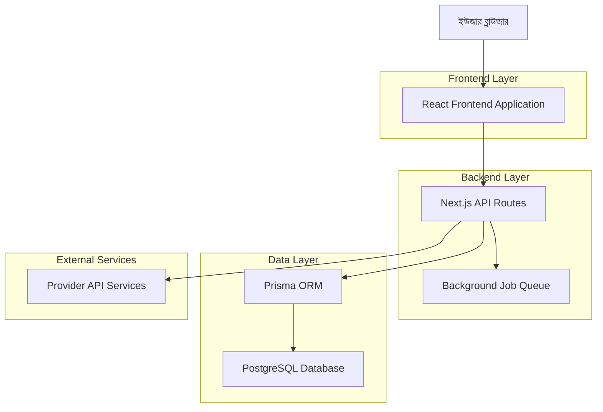
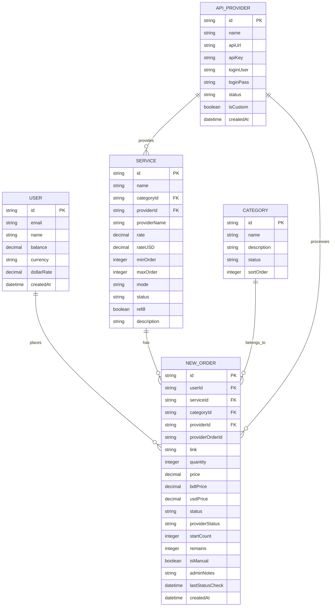

# প্রোভাইডার অর্ডার সিস্টেম - টেকনিক্যাল আর্কিটেকচার

## ১. আর্কিটেকচার ডিজাইন



## ২. টেকনোলজি বর্ণনা

* **Frontend**: React\@18 + Next.js\@14 + TypeScript + Tailwind CSS

* **Backend**: Next.js API Routes + Prisma ORM

* **Database**: PostgreSQL (Supabase)

* **Authentication**: NextAuth.js

* **External APIs**: Provider REST APIs

## ৩. রুট ডেফিনিশন

| রুট                  | উদ্দেশ্য                         |
| -------------------- | -------------------------------- |
| /admin/orders        | অ্যাডমিন অর্ডার ম্যানেজমেন্ট পেজ |
| /admin/orders/manual | ম্যানুয়াল অর্ডার তৈরি পেজ       |
| /admin/providers     | প্রোভাইডার কনফিগারেশন পেজ        |
| /admin/orders/sync   | অর্ডার স্ট্যাটাস সিঙ্ক পেজ       |
| /user/orders/create  | ইউজার অর্ডার তৈরি পেজ            |
| /user/orders         | ইউজার অর্ডার হিস্টরি পেজ         |

## ৪. API ডেফিনিশন

### ৪.১ মূল API

#### অর্ডার তৈরি API

```
POST /api/user/create-orders
```

Request:

| প্যারামিটার নাম | প্যারামিটার টাইপ | আবশ্যক | বর্ণনা               |
| --------------- | ---------------- | ------ | -------------------- |
| categoryId      | string           | true   | সার্ভিস ক্যাটেগরি ID |
| serviceId       | string           | true   | সার্ভিস ID           |
| link            | string           | true   | টার্গেট লিংক         |
| qty             | number           | true   | অর্ডার পরিমাণ        |

Response:

| প্যারামিটার নাম | প্যারামিটার টাইপ | বর্ণনা                 |
| --------------- | ---------------- | ---------------------- |
| success         | boolean          | অর্ডার সফল হয়েছে কিনা |
| ordersCreated   | number           | তৈরি অর্ডারের সংখ্যা   |
| totalCost       | number           | মোট খরচ                |
| currency        | string           | মুদ্রার ধরন            |

Example:

```json
{
  "categoryId": "cat_123",
  "serviceId": "svc_456",
  "link": "https://instagram.com/profile",
  "qty": 1000
}
```

#### প্রোভাইডার অর্ডার ফরওয়ার্ড API

```
POST /api/admin/orders/forward-to-provider
```

Request:

| প্যারামিটার নাম | প্যারামিটার টাইপ | আবশ্যক | বর্ণনা             |
| --------------- | ---------------- | ------ | ------------------ |
| orderId         | string           | true   | স্থানীয় অর্ডার ID |
| providerId      | string           | true   | প্রোভাইডার ID      |

Response:

| প্যারামিটার নাম | প্যারামিটার টাইপ | বর্ণনা                    |
| --------------- | ---------------- | ------------------------- |
| success         | boolean          | ফরওয়ার্ড সফল হয়েছে কিনা |
| providerOrderId | string           | প্রোভাইডার অর্ডার ID      |
| status          | string           | অর্ডার স্ট্যাটাস          |

#### অর্ডার স্ট্যাটাস সিঙ্ক API

```
POST /api/admin/orders/sync-status
```

Request:

| প্যারামিটার নাম | প্যারামিটার টাইপ | আবশ্যক | বর্ণনা                       |
| --------------- | ---------------- | ------ | ---------------------------- |
| orderId         | string           | false  | নির্দিষ্ট অর্ডার ID (ঐচ্ছিক) |
| forceSync       | boolean          | false  | জোরপূর্বক সিঙ্ক              |

Response:

| প্যারামিটার নাম | প্যারামিটার টাইপ | বর্ণনা                      |
| --------------- | ---------------- | --------------------------- |
| success         | boolean          | সিঙ্ক সফল হয়েছে কিনা       |
| syncedOrders    | number           | সিঙ্ক হওয়া অর্ডারের সংখ্যা |
| errors          | array            | ত্রুটির তালিকা              |

#### ম্যানুয়াল অর্ডার তৈরি API

```
POST /api/admin/orders/manual
```

Request:

| প্যারামিটার নাম | প্যারামিটার টাইপ | আবশ্যক | বর্ণনা         |
| --------------- | ---------------- | ------ | -------------- |
| userId          | string           | true   | ব্যবহারকারী ID |
| serviceId       | string           | true   | সার্ভিস ID     |
| link            | string           | true   | টার্গেট লিংক   |
| quantity        | number           | true   | অর্ডার পরিমাণ  |
| adminNotes      | string           | false  | অ্যাডমিন নোট   |

Response:

| প্যারামিটার নাম | প্যারামিটার টাইপ | বর্ণনা                      |
| --------------- | ---------------- | --------------------------- |
| success         | boolean          | অর্ডার তৈরি সফল হয়েছে কিনা |
| orderId         | string           | তৈরি অর্ডার ID              |
| totalCost       | number           | মোট খরচ                     |

## ৫. সার্ভার আর্কিটেকচার ডায়াগ্রাম

```mermaid
graph TD
    A[Client / Frontend] --> B[API Route Handler]
    B --> C[Authentication Middleware]
    C --> D[Validation Layer]
    D --> E[Business Logic Layer]
    E --> F[Provider Service Layer]
    E --> G[Database Layer (Prisma)]
    F --> H[External Provider APIs]
    G --> I[(PostgreSQL Database)]
    
    subgraph "Next.js Server"
        B
        C
        D
        E
        F
        G
    end
```

## ৬. ডাটা মডেল

### ৬.১ ডাটা মডেল ডেফিনিশন



### ৬.২ ডাটা ডেফিনিশন ল্যাঙ্গুয়েজ

#### NewOrder টেবিল আপডেট

```sql
-- প্রোভাইডার সম্পর্কিত নতুন কলাম যোগ করা
ALTER TABLE "NewOrder" ADD COLUMN "providerOrderId" VARCHAR(255);
ALTER TABLE "NewOrder" ADD COLUMN "providerId" VARCHAR(255);
ALTER TABLE "NewOrder" ADD COLUMN "providerStatus" VARCHAR(50);
ALTER TABLE "NewOrder" ADD COLUMN "lastStatusCheck" TIMESTAMP;
ALTER TABLE "NewOrder" ADD COLUMN "isManual" BOOLEAN DEFAULT false;
ALTER TABLE "NewOrder" ADD COLUMN "adminNotes" TEXT;

-- ইনডেক্স তৈরি করা
CREATE INDEX "idx_neworder_status" ON "NewOrder"("status");
CREATE INDEX "idx_neworder_provider_order_id" ON "NewOrder"("providerOrderId");
CREATE INDEX "idx_neworder_provider_id" ON "NewOrder"("providerId");
CREATE INDEX "idx_neworder_last_status_check" ON "NewOrder"("lastStatusCheck");

-- প্রোভাইডার রেফারেন্স যোগ করা
ALTER TABLE "NewOrder" ADD CONSTRAINT "fk_neworder_provider" 
FOREIGN KEY ("providerId") REFERENCES "ApiProvider"("id");
```

#### ActivityLog টেবিল আপডেট

```sql
-- প্রোভাইডার অ্যাক্টিভিটি লগিংয়ের জন্য
ALTER TABLE "ActivityLog" ADD COLUMN "providerOrderId" VARCHAR(255);
ALTER TABLE "ActivityLog" ADD COLUMN "providerId" VARCHAR(255);
ALTER TABLE "ActivityLog" ADD COLUMN "providerResponse" JSONB;

-- ইনডেক্স তৈরি করা
CREATE INDEX "idx_activitylog_provider_order_id" ON "ActivityLog"("providerOrderId");
```

#### প্রাথমিক ডাটা ইনসার্ট

```sql
-- নমুনা প্রোভাইডার ডাটা
INSERT INTO "ApiProvider" ("id", "name", "apiUrl", "apiKey", "status", "isCustom")
VALUES 
('provider_001', 'SMM Provider 1', 'https://provider1.com/api/v2', 'api_key_here', 'active', false),
('provider_002', 'SMM Provider 2', 'https://provider2.com/api', 'api_key_here', 'active', false);

-- নমুনা সার্ভিস ডাটা আপডেট
UPDATE "Service" SET 
"providerId" = 'provider_001',
"providerName" = 'SMM Provider 1',
"mode" = 'auto'
WHERE "id" IN ('service_001', 'service_002');
```

