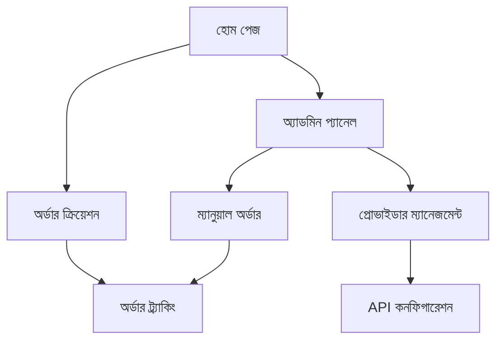

# SMM Panel Provider Order Forwarding System ডকুমেন্টেশন

## ১. সিস্টেম ওভারভিউ এবং আর্কিটেকচার

### ১.১ প্রোডাক্ট ওভারভিউ
SMM Panel Provider Order Forwarding System হল একটি স্বয়ংক্রিয় অর্ডার ম্যানেজমেন্ট সিস্টেম যা গ্রাহকদের অর্ডারগুলি বিভিন্ন বাহ্যিক প্রোভাইডারদের কাছে ফরওয়ার্ড করে এবং রিয়েল-টাইমে অর্ডার স্ট্যাটাস ট্র্যাক করে।

- মূল উদ্দেশ্য: গ্রাহকদের অর্ডার প্রক্রিয়াকরণ স্বয়ংক্রিয় করা এবং একাধিক প্রোভাইডারের সাথে সমন্বয় সাধন করা
- টার্গেট মার্কেট: SMM সার্ভিস প্রোভাইডার এবং রিসেলার প্যানেল

### ১.২ কোর ফিচার

#### ১.২.১ ব্যবহারকারীর ভূমিকা
| ভূমিকা | নিবন্ধন পদ্ধতি | মূল অনুমতি |
|---------|------------------|-------------|
| সাধারণ ব্যবহারকারী | ইমেইল নিবন্ধন | অর্ডার তৈরি এবং ট্র্যাক করতে পারে |
| অ্যাডমিন | সুপার অ্যাডমিন দ্বারা তৈরি | সম্পূর্ণ সিস্টেম নিয়ন্ত্রণ এবং ম্যানুয়াল অর্ডার ম্যানেজমেন্ট |

#### ১.২.২ ফিচার মডিউল
আমাদের Provider Order Forwarding System এর মূল পেজগুলি:
1. **অর্ডার ক্রিয়েশন পেজ**: অটোমেটিক প্রোভাইডার ফরওয়ার্ডিং, ব্যালেন্স চেক, অর্ডার ভ্যালিডেশন
2. **অর্ডার ট্র্যাকিং পেজ**: রিয়েল-টাইম স্ট্যাটাস আপডেট, প্রোভাইডার স্ট্যাটাস সিঙ্ক
3. **অ্যাডমিন ম্যানুয়াল অর্ডার পেজ**: ম্যানুয়াল অর্ডার তৈরি, স্ট্যাটাস আপডেট, অর্ডার নোট
4. **প্রোভাইডার ম্যানেজমেন্ট পেজ**: API কনফিগারেশন, প্রোভাইডার স্ট্যাটাস মনিটরিং

#### ১.২.৩ পেজ বিস্তারিত
| পেজ নাম | মডিউল নাম | ফিচার বিবরণ |
|----------|-------------|---------------|
| অর্ডার ক্রিয়েশন | অটো ফরওয়ার্ডিং | প্রোভাইডার API কল, অর্ডার ভ্যালিডেশন, ব্যালেন্স ডিডাকশন |
| অর্ডার ট্র্যাকিং | স্ট্যাটাস সিঙ্ক | প্রোভাইডার থেকে স্ট্যাটাস আপডেট, অটোমেটিক রিফ্রেশ |
| অ্যাডমিন প্যানেল | ম্যানুয়াল কন্ট্রোল | ম্যানুয়াল অর্ডার তৈরি, স্ট্যাটাস মডিফিকেশন, নোট যোগ |
| প্রোভাইডার সেটিং | API কনফিগ | প্রোভাইডার API URL, কী ম্যানেজমেন্ট, স্ট্যাটাস চেক |

## ২. কোর প্রসেস

### ২.১ সাধারণ ব্যবহারকারীর ফ্লো
1. ব্যবহারকারী অর্ডার তৈরি করে
2. সিস্টেম সার্ভিস এবং প্রোভাইডার ভ্যালিডেট করে
3. ব্যালেন্স চেক এবং ডিডাকশন
4. প্রোভাইডারে অর্ডার ফরওয়ার্ড
5. প্রোভাইডার রেসপন্স প্রসেসিং
6. লোকাল ডাটাবেস আপডেট

### ২.২ অ্যাডমিন ফ্লো
1. অ্যাডমিন ম্যানুয়াল অর্ডার তৈরি করে
2. সিস্টেম ভ্যালিডেশন এবং প্রাইস ক্যালকুলেশন
3. ডাটাবেসে অর্ডার সেভ (ম্যানুয়াল ফ্ল্যাগ সহ)
4. অ্যাডমিন স্ট্যাটাস এবং নোট আপডেট করতে পারে

### ২.৩ পেজ নেভিগেশন ফ্লোচার্ট


## ৩. প্রোভাইডার ইন্টিগ্রেশন ওয়ার্কফ্লো

### ৩.১ অর্ডার ফরওয়ার্ডিং প্রসেস
1. **অর্ডার ভ্যালিডেশন**: সার্ভিস মোড চেক (auto/manual)
2. **প্রোভাইডার সিলেকশন**: সার্ভিসের সাথে যুক্ত প্রোভাইডার খুঁজে বের করা
3. **API কল প্রিপারেশন**: URLSearchParams দিয়ে রিকোয়েস্ট বডি তৈরি
4. **HTTP রিকোয়েস্ট**: POST method দিয়ে প্রোভাইডার API তে পাঠানো
5. **রেসপন্স প্রসেসিং**: প্রোভাইডার অর্ডার ID এবং স্ট্যাটাস আপডেট

### ৩.২ API রিকোয়েস্ট ফরম্যাট
```javascript
const requestBody = new URLSearchParams({
    key: provider.api_key,
    action: 'add',
    service: service.providerId,
    link: order.link,
    quantity: order.qty
});
```

### ৩.৩ প্রোভাইডার রেসপন্স হ্যান্ডলিং
- **সফল রেসপন্স**: প্রোভাইডার অর্ডার ID সেভ করা
- **এরর রেসপন্স**: এরর লগিং এবং অর্ডার স্ট্যাটাস 'failed' সেট করা
- **টাইমআউট**: রিট্রাই মেকানিজম এবং এরর হ্যান্ডলিং

## ৪. অর্ডার স্ট্যাটাস ট্র্যাকিং সিস্টেম

### ৪.১ স্ট্যাটাস ম্যাপিং
| প্রোভাইডার স্ট্যাটাস | ইন্টার্নাল স্ট্যাটাস | বিবরণ |
|---------------------|-------------------|--------|
| Pending | pending | অর্ডার প্রসেসিং এর জন্য অপেক্ষমান |
| In progress | processing | অর্ডার প্রসেসিং চলমান |
| Completed | completed | অর্ডার সম্পন্ন |
| Partial | partial | আংশিক সম্পন্ন |
| Canceled | canceled | অর্ডার বাতিল |

### ৪.২ অটোমেটিক স্ট্যাটাস সিঙ্ক
- **সিঙ্ক ইন্টারভাল**: প্রতি ১৫ মিনিট অন্তর
- **ব্যাচ প্রসেসিং**: একসাথে ১০০টি অর্ডার চেক
- **রেট লিমিটিং**: প্রতি API কলের মধ্যে ২ সেকেন্ড বিরতি

### ৪.৩ ম্যানুয়াল সিঙ্ক
- অ্যাডমিন যেকোনো সময় ম্যানুয়াল সিঙ্ক ট্রিগার করতে পারে
- নির্দিষ্ট অর্ডারের জন্য ফোর্স সিঙ্ক অপশন

## ৫. ম্যানুয়াল অর্ডার ক্রিয়েশন প্রসেস

### ৫.১ অ্যাডমিন অর্ডার ক্রিয়েশন
1. **ব্যবহারকারী সিলেকশন**: ভ্যালিড ব্যবহারকারী আইডি চেক
2. **সার্ভিস ভ্যালিডেশন**: সার্ভিস এবং ক্যাটেগরি এক্সিস্ট চেক
3. **প্রাইস ক্যালকুলেশন**: USD এবং BDT রেট অনুযায়ী
4. **ডাটাবেস এন্ট্রি**: isManual ফ্ল্যাগ সহ অর্ডার সেভ
5. **অ্যাক্টিভিটি লগিং**: অ্যাডমিন অ্যাকশন লগ

### ৫.২ ম্যানুয়াল অর্ডার আপডেট
- **স্ট্যাটাস চেঞ্জ**: যেকোনো স্ট্যাটাসে পরিবর্তন
- **স্টার্ট কাউন্ট**: ইনিশিয়াল ফলোয়ার/লাইক কাউন্ট
- **রিমেইনস**: বাকি পরিমাণ
- **অ্যাডমিন নোট**: অতিরিক্ত তথ্য যোগ

## ৬. API এন্ডপয়েন্ট ডকুমেন্টেশন

### ৬.১ অর্ডার ক্রিয়েশন API
```
POST /api/user/create-orders
```

**রিকোয়েস্ট প্যারামিটার:**
| প্যারাম নাম | প্যারাম টাইপ | আবশ্যক | বিবরণ |
|-------------|--------------|---------|--------|
| categoryId | string | true | ক্যাটেগরি আইডি |
| serviceId | string | true | সার্ভিস আইডি |
| link | string | true | টার্গেট লিংক |
| qty | number | true | অর্ডার পরিমাণ |

**রেসপন্স:**
```json
{
  "success": true,
  "ordersCreated": 1,
  "totalCost": 100,
  "currency": "BDT"
}
```

### ৬.২ ম্যানুয়াল অর্ডার API
```
POST /api/admin/orders/manual
```

**রিকোয়েস্ট প্যারামিটার:**
| প্যারাম নাম | প্যারাম টাইপ | আবশ্যক | বিবরণ |
|-------------|--------------|---------|--------|
| userId | string | true | ব্যবহারকারী আইডি |
| serviceId | string | true | সার্ভিস আইডি |
| link | string | true | টার্গেট লিংক |
| quantity | number | true | অর্ডার পরিমাণ |
| adminNotes | string | false | অ্যাডমিন নোট |

### ৬.৩ স্ট্যাটাস সিঙ্ক API
```
POST /api/admin/orders/sync-status
GET /api/admin/orders/sync-status
```

**POST রিকোয়েস্ট:**
| প্যারাম নাম | প্যারাম টাইপ | আবশ্যক | বিবরণ |
|-------------|--------------|---------|--------|
| orderId | string | false | নির্দিষ্ট অর্ডার আইডি |
| forceSync | boolean | false | ফোর্স সিঙ্ক |

## ৭. ডাটাবেস স্কিমা পরিবর্তন

### ৭.১ NewOrder মডেল আপডেট
```prisma
model NewOrder {
  // ... existing fields
  providerOrderId String?   // প্রোভাইডার অর্ডার আইডি
  providerId      String?   // প্রোভাইডার আইডি
  providerStatus  String?   // প্রোভাইডার স্ট্যাটাস
  lastStatusCheck DateTime? // শেষ স্ট্যাটাস চেক
  isManual        Boolean   @default(false) // ম্যানুয়াল অর্ডার ফ্ল্যাগ
  adminNotes      String?   // অ্যাডমিন নোট
  
  @@index([status])
  @@index([providerOrderId])
  @@index([providerId])
}
```

### ৭.২ নতুন ইনডেক্স
- `status` ইনডেক্স: দ্রুত স্ট্যাটাস ফিল্টারিং
- `providerOrderId` ইনডেক্স: প্রোভাইডার অর্ডার লুকআপ
- `providerId` ইনডেক্স: প্রোভাইডার ভিত্তিক কোয়েরি

## ৮. এরর হ্যান্ডলিং এবং লগিং

### ৮.১ এরর ক্যাটেগরি
1. **নেটওয়ার্ক এরর**: প্রোভাইডার API কানেকশন ব্যর্থতা
2. **ভ্যালিডেশন এরর**: ইনভ্যালিড ইনপুট ডেটা
3. **অথেন্টিকেশন এরর**: প্রোভাইডার API কী সমস্যা
4. **বিজনেস লজিক এরর**: অপর্যাপ্ত ব্যালেন্স, সার্ভিস অনুপলব্ধ

### ৮.২ লগিং স্ট্র্যাটেজি
```javascript
// অর্ডার ফরওয়ার্ডিং লগ
console.log(`[ORDER_FORWARD] Order ${orderId} forwarded to provider ${providerId}`);

// এরর লগ
console.error(`[PROVIDER_ERROR] Failed to forward order ${orderId}:`, error);

// স্ট্যাটাস আপডেট লগ
console.log(`[STATUS_UPDATE] Order ${orderId} status changed: ${oldStatus} -> ${newStatus}`);
```

### ৮.৩ রিট্রাই মেকানিজম
- **ম্যাক্স রিট্রাই**: ৩ বার
- **রিট্রাই ইন্টারভাল**: ৫, ১০, ২০ সেকেন্ড
- **এক্সপোনেনশিয়াল ব্যাকঅফ**: প্রতিবার দ্বিগুণ বিলম্ব

## ৯. নিরাপত্তা বিবেচনা

### ৯.১ API নিরাপত্তা
- **অথেন্টিকেশন**: JWT টোকেন ভ্যালিডেশন
- **অথরাইজেশন**: রোল-বেসড অ্যাক্সেস কন্ট্রোল
- **রেট লিমিটিং**: প্রতি মিনিটে ১০০ রিকোয়েস্ট
- **ইনপুট ভ্যালিডেশন**: সব ইনপুট স্যানিটাইজেশন

### ৯.২ ডেটা নিরাপত্তা
- **API কী এনক্রিপশন**: প্রোভাইডার API কী এনক্রিপ্ট করে স্টোর
- **সেনসিটিভ ডেটা মাস্কিং**: লগে পাসওয়ার্ড/কী লুকানো
- **HTTPS এনফোর্সমেন্ট**: সব API কল HTTPS দিয়ে

### ৯.৩ অ্যাক্সেস কন্ট্রোল
- **অ্যাডমিন অনলি**: ম্যানুয়াল অর্ডার এবং প্রোভাইডার ম্যানেজমেন্ট
- **ব্যবহারকারী স্কোপ**: নিজের অর্ডার শুধুমাত্র দেখতে পারে
- **অডিট ট্রেইল**: সব অ্যাডমিন অ্যাকশন লগ

## ১০. পারফরম্যান্স অপটিমাইজেশন

### ১০.১ ডাটাবেস অপটিমাইজেশন
- **ইনডেক্সিং**: ফ্রিকোয়েন্ট কোয়েরি ফিল্ডে ইনডেক্স
- **কানেকশন পুলিং**: ডাটাবেস কানেকশন রিইউজ
- **কোয়েরি অপটিমাইজেশন**: N+1 সমস্যা এড়ানো

### ১০.২ API পারফরম্যান্স
- **ক্যাশিং**: ফ্রিকোয়েন্ট ডেটা Redis এ ক্যাশ
- **ব্যাচ প্রসেসিং**: একসাথে একাধিক অর্ডার প্রসেস
- **অ্যাসিঙ্ক প্রসেসিং**: ব্যাকগ্রাউন্ডে স্ট্যাটাস আপডেট

### ১০.৩ মনিটরিং
- **রেসপন্স টাইম ট্র্যাকিং**: API রেসপন্স টাইম মনিটর
- **এরর রেট মনিটরিং**: এরর পারসেন্টেজ ট্র্যাক
- **রিসোর্স ইউটিলাইজেশন**: CPU, মেমরি ব্যবহার মনিটর

এই ডকুমেন্টেশন SMM Panel Provider Order Forwarding System এর সম্পূর্ণ কার্যকারিতা এবং বাস্তবায়নের বিস্তারিত তুলে ধরে।