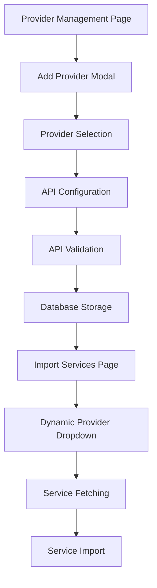
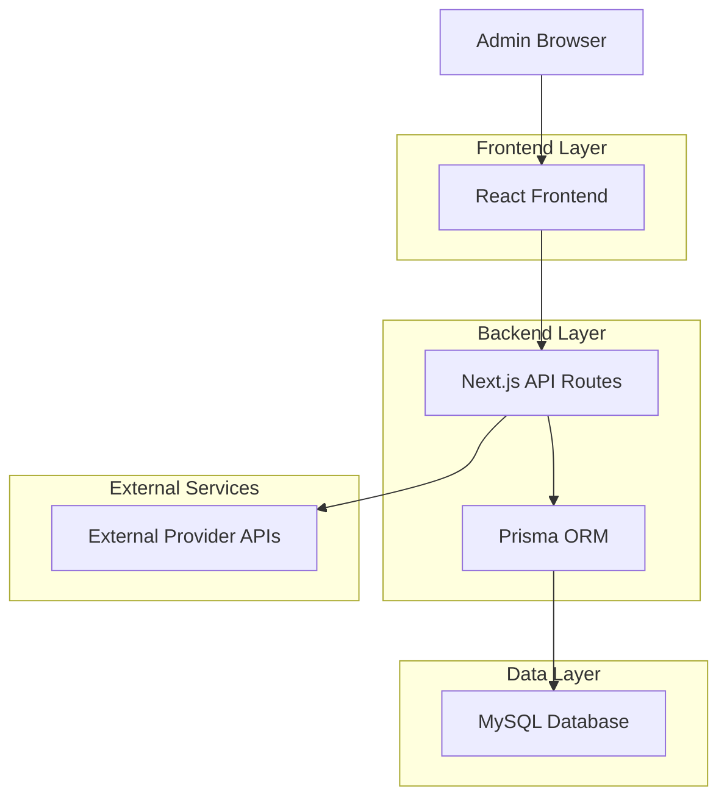
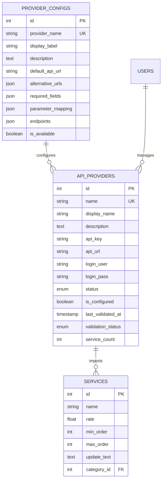

# Dynamic Provider Addition Feature - SMMDOC Admin Panel

## 1. Product Overview

এই feature টি SMMDOC admin panel এ dynamic provider management system implement করে যেখানে admin রা UI থেকে নতুন API provider যোগ করতে পারবেন, database এ automatically store হবে, এবং import services page এ dynamically show হবে। Provider validation এর মাধ্যমে শুধুমাত্র valid provider থেকে service fetch করা হবে।

## 2. Core Features

### 2.1 User Roles

| Role        | Registration Method | Core Permissions                                                    |
| ----------- | ------------------- | ------------------------------------------------------------------- |
| Admin       | System assigned     | Full provider management, add/edit/delete providers, service import |
| Super Admin | System assigned     | All admin permissions plus system configuration                     |

### 2.2 Feature Module

আমাদের dynamic provider addition feature এ নিম্নলিখিত main pages রয়েছে:

1. **Provider Management Page**: Provider list view, add/edit/delete functionality, status management
2. **Add Provider Modal**: Dynamic provider selection form, API configuration, validation
3. **Import Services Page**: Dynamic provider dropdown, category selection, service preview
4. **Provider Configuration Page**: Individual provider settings, API endpoint management

### 2.3 Page Details

| Page Name              | Module Name         | Feature description                                                            |
| ---------------------- | ------------------- | ------------------------------------------------------------------------------ |
| Provider Management    | Provider List       | Display all configured providers with status, statistics, and action buttons   |
| Provider Management    | Add Provider Button | Open modal for adding new provider with dynamic form fields                    |
| Provider Management    | Provider Cards      | Show provider info, API status, service count, and quick actions               |
| Add Provider Modal     | Provider Selection  | Dynamic dropdown with available provider options from configuration            |
| Add Provider Modal     | API Configuration   | Form fields for API key, URL, username/password based on provider requirements |
| Add Provider Modal     | Validation System   | Real-time API validation and connection testing                                |
| Import Services        | Provider Dropdown   | Dynamically populated dropdown showing only active configured providers        |
| Import Services        | Service Fetching    | Automatic service fetch from selected provider with loading states             |
| Import Services        | Service Preview     | Display fetched services with category filtering and selection options         |
| Provider Configuration | API Settings        | Individual provider API endpoint and parameter configuration                   |
| Provider Configuration | Status Management   | Enable/disable provider, sync settings, and health monitoring                  |

## 3. Core Process

### Admin Flow - Adding New Provider

1. Admin navigates to Provider Management page
2. Clicks "Add Provider" button
3. Selects provider type from dynamic dropdown
4. Fills in API configuration (key, URL, credentials)
5. System validates API connection
6. Provider gets saved to database with active status
7. Provider becomes available in import services dropdown

### Admin Flow - Service Import

1. Admin goes to Import Services page
2. Selects provider from dynamically populated dropdown
3. System fetches available services from provider API
4. Admin selects categories and services to import
5. System imports services with profit margin calculation
6. Services become available for customers



## 4. User Interface Design

### 4.1 Design Style

* Primary colors: Purple gradient (#8B5CF6 to #A855F7), Blue accent (#3B82F6)

* Secondary colors: Gray scale (#F8FAFC to #1E293B)

* Button style: Rounded corners (8px), gradient backgrounds, hover effects

* Font: Inter, sizes 12px-24px for different elements

* Layout style: Card-based design, responsive grid layout, sidebar navigation

* Icons: React Icons (FaPlus, FaEdit, FaTrash, FaSync, FaCheck)

### 4.2 Page Design Overview

| Page Name           | Module Name         | UI Elements                                                                             |
| ------------------- | ------------------- | --------------------------------------------------------------------------------------- |
| Provider Management | Provider Cards      | Card layout with gradient borders, status badges (green/red), action buttons with icons |
| Provider Management | Add Provider Button | Purple gradient button with plus icon, positioned top-right                             |
| Add Provider Modal  | Provider Selection  | Dropdown with search functionality, provider logos, descriptions                        |
| Add Provider Modal  | Form Fields         | Input fields with labels, password toggle, validation messages                          |
| Import Services     | Provider Dropdown   | Styled select with provider status indicators, loading spinner                          |
| Import Services     | Service Grid        | Table layout with checkboxes, category filters, pagination                              |

### 4.3 Responsiveness

Desktop-first design with mobile-adaptive breakpoints. Touch interaction optimization for mobile devices. Responsive grid system for provider cards and service tables.

## 5. Technical Architecture

### 5.1 Architecture Design



### 5.2 Technology Description

* Frontend: React\@18 + Next.js\@14 + TypeScript + TailwindCSS

* Backend: Next.js API Routes + Prisma ORM

* Database: MySQL with Prisma schema

* Authentication: NextAuth.js

* State Management: React hooks + SWR for data fetching

### 5.3 Route Definitions

| Route                         | Purpose                                              |
| ----------------------------- | ---------------------------------------------------- |
| /admin/settings/providers     | Provider management page with CRUD operations        |
| /admin/services/import        | Service import page with dynamic provider selection  |
| /api/admin/providers          | Provider CRUD API endpoints (GET, POST, PUT, DELETE) |
| /api/admin/providers/validate | Provider API validation endpoint                     |
| /api/admin/services/import    | Service fetching and import API                      |

### 5.4 API Definitions

#### Provider Management APIs

**Get All Providers**

```
GET /api/admin/providers
```

Response:

| Param Name | Param Type | Description                                |
| ---------- | ---------- | ------------------------------------------ |
| success    | boolean    | Operation status                           |
| data       | object     | Provider data with configured status       |
| <br />     | <br />     | <br />                                     |
| providers  | array      | List of available and configured providers |

**Add New Provider**

```
POST /api/admin/providers
```

Request:

| Param Name       | Param Type | isRequired | Description                                  |
| ---------------- | ---------- | ---------- | -------------------------------------------- |
| selectedProvider | string     | true       | Provider identifier (smmgen, attpanel, etc.) |
| apiKey           | string     | true       | Provider API key                             |
| apiUrl           | string     | false      | Custom API URL if different from default     |
| username         | string     | false      | Provider username if required                |
| password         | string     | false      | Provider password if required                |

**Validate Provider API**

```
POST /api/admin/providers/validate
```

Request:

| Param Name | Param Type | isRequired | Description         |
| ---------- | ---------- | ---------- | ------------------- |
| provider   | string     | true       | Provider name       |
| apiKey     | string     | true       | API key to validate |
| apiUrl     | string     | false      | API URL to test     |

#### Service Import APIs

**Fetch Provider Services**

```
POST /api/admin/services/import
```

Request:

| Param Name | Param Type | isRequired | Description                   |
| ---------- | ---------- | ---------- | ----------------------------- |
| action     | string     | true       | "services"                    |
| providerId | string     | true       | Provider database ID          |
| categories | array      | false      | Selected categories to filter |

**Import Services**

```
PUT /api/admin/services/import
```

Request:

| Param Name   | Param Type | isRequired | Description                            |
| ------------ | ---------- | ---------- | -------------------------------------- |
| providerId   | string     | true       | Provider database ID                   |
| services     | array      | true       | Selected services to import            |
| profitMargin | number     | false      | Profit margin percentage (default: 20) |

### 5.5 Data Model

#### Database Schema Updates

**Enhanced ApiProvider Table**

```sql
CREATE TABLE api_providers (
    id INT PRIMARY KEY AUTO_INCREMENT,
    name VARCHAR(191) UNIQUE NOT NULL,
    display_name VARCHAR(191) NOT NULL,
    description TEXT,
    api_key VARCHAR(191) NOT NULL,
    api_url VARCHAR(191) DEFAULT '',
    login_user VARCHAR(191) NULL,
    login_pass VARCHAR(191) NULL,
    status ENUM('active', 'inactive') DEFAULT 'inactive',
    is_configured BOOLEAN DEFAULT FALSE,
    last_validated_at TIMESTAMP NULL,
    validation_status ENUM('valid', 'invalid', 'pending') DEFAULT 'pending',
    service_count INT DEFAULT 0,
    last_sync_at TIMESTAMP NULL,
    created_at TIMESTAMP DEFAULT CURRENT_TIMESTAMP,
    updated_at TIMESTAMP DEFAULT CURRENT_TIMESTAMP ON UPDATE CURRENT_TIMESTAMP,
    
    INDEX idx_status (status),
    INDEX idx_name (name),
    INDEX idx_configured (is_configured)
);
```

**Provider Configuration Table**

```sql
CREATE TABLE provider_configs (
    id INT PRIMARY KEY AUTO_INCREMENT,
    provider_name VARCHAR(191) UNIQUE NOT NULL,
    display_label VARCHAR(191) NOT NULL,
    description TEXT,
    default_api_url VARCHAR(191),
    alternative_urls JSON,
    required_fields JSON,
    parameter_mapping JSON,
    endpoints JSON,
    is_available BOOLEAN DEFAULT TRUE,
    created_at TIMESTAMP DEFAULT CURRENT_TIMESTAMP,
    updated_at TIMESTAMP DEFAULT CURRENT_TIMESTAMP ON UPDATE CURRENT_TIMESTAMP
);
```

#### Data Relationships



### 5.6 Implementation Workflow

#### Phase 1: Database Schema Enhancement

1. Update ApiProvider model with new fields
2. Create ProviderConfig model for dynamic configuration
3. Add migration scripts for existing data
4. Seed provider configurations

#### Phase 2: Backend API Development

1. Enhance provider CRUD endpoints
2. Implement provider validation API
3. Update service import logic for dynamic providers
4. Add provider health check functionality

#### Phase 3: Frontend UI Implementation

1. Update provider management page with dynamic forms
2. Implement add provider modal with validation
3. Enhance import services page with dynamic dropdown
4. Add real-time status updates

#### Phase 4: Integration & Testing

1. End-to-end testing of provider addition flow
2. API validation testing with multiple providers
3. Service import testing with dynamic providers
4. Performance optimization and error handling

### 5.7 Security Considerations

* API key encryption in database storage

* Input validation and sanitization

* Rate limiting for provider API calls

* Admin authentication and authorization

* Secure credential handling for provider authentication

* API endpoint protection with CSRF tokens

### 5.8 Error Handling & Validation

* Provider API connection validation

* Real-time form validation with error messages

* Graceful handling of provider API failures

* Retry mechanisms for failed API calls

* User-friendly error notifications

* Logging system for debugging provider issues

এই comprehensive documentation টি SMMDOC admin panel এ dynamic provider addition feature implement করার জন্য সম্পূর্ণ technical roadmap প্রদান করে।
